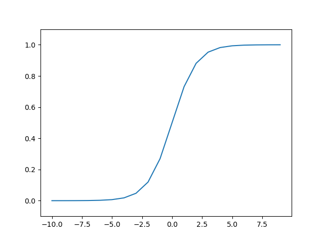
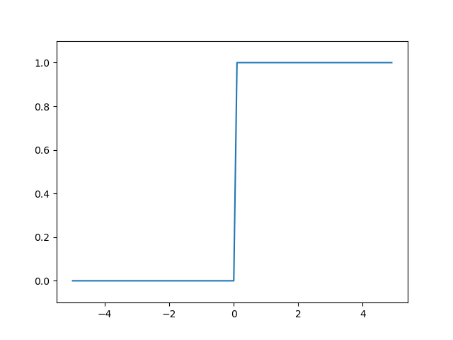
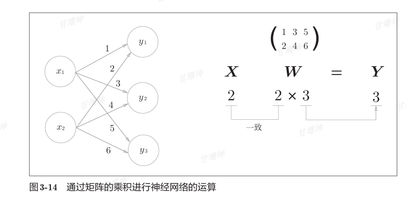
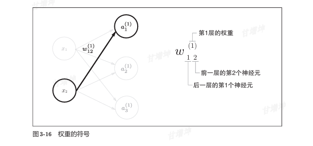
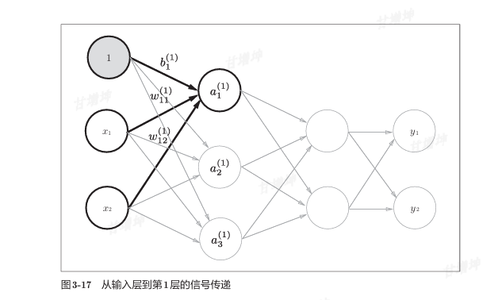
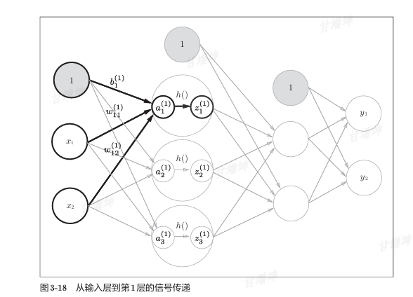
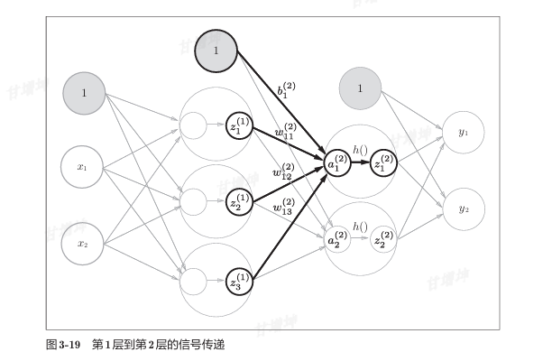
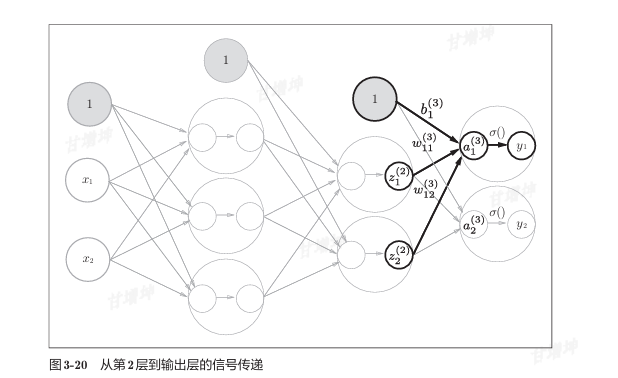

# 深度学习-笔记
## 深度学习入门：基于Python的理论实现
## 感知机

## 神经网络

### 激活函数

#### sigmoid函数
**函数**

```python
x = np.arange(0, 10)
y = 1 / (1 + math.e ** (-x))
plt.plot(x, y)
plt.show()
```


**函数图像**


#### 阶跃函数

**函数**

```pyth
def step_function(k):
    if k > 5:
        return 1
    else:
        return 0
def step_function_numpy(k):
    z = k > 0
    return z.astype(int)
x = np.arange(-5.0, 5.0, 0.1)
y = step_function_numpy(x)
plt.plot(x, y)
plt.ylim(-0.1, 1.1) # 指定y轴的范围
plt.show()
```


**函数图像**



**两个函数的比较**


#### ReLU函数


### 神经网络实现

#### 内积




#### 符号确认



#### 各层间信号传递的实现



逻辑如下图


加上激活函数以及偏置

输入层到第一层



第一层到第二层



第二层到输出层



代码实现

```python
import numpy as np
import math
import activationFunction as af

# 3层神经网络实现
# 第一层
X = np.array([1, 2])
W1 = np.array([[0.1, 0.3, 0.5], [0.2, 0.4, 0.6]])
B1 = np.array([0.1, 0.2, 0.3])
A1 = np.dot(X, W1) + B1
Z1 = af.sigmoid(A1)
print(A1)
print(Z1)

# 第二层
W2 = np.array([[0.1, 0.4], [0.2, 0.5], [0.3, 0.6]])
B2 = np.array([0.1, 0.2])
A2 = np.dot(Z1, W2) + B2
Z2 = af.sigmoid(A2)
print(A2)
print(Z2)

# 输出层
W3 = np.array([[0.1, 0.3], [0.2, 0.4]])
B3 = np.array([0.1, 0.2])
A3 = np.dot(Z2, W3) + B3
Z3 = af.identity_function(A3)
print(A3)
print(Z3)
```


### 输出层

#### 恒等函数

```python
def identity_function(x):
    return x
```

#### softmax函数

```python
# softmax函数   输出总和为1是softmax函数的一个重要性质
# 因为和为1 每个输出值代表该神经元对应类别的概率。
# 单调递增函数
# 所以 索引 x 的大小影响这y大小,如果只是输出一个最大概率，其实只看x里面最大的数值就行，这种情况输出层这个函数可以省略
def softmax(x):
    # 防止数值过大
    c = np.max(x)
    exp_x = np.exp(x-c)
    sum_exp_a = np.sum(exp_x)
    y = exp_x / sum_exp_a
    return y
```


### 数字识别实现


## 神经网络学习

“学习”是指从训练数据中自动获取最优权重参数的过程。


### 学习


**特征量**

**特征量**是指可以 从输入数据（输入图像）中准确地提取本质数据（重要的数据）的转换器

在计算机视觉领域，常用的特征量包括SIFT、SURF和HOG等。使用这些特征量将图像数据转换为向量，然后对转换后的向量使用机器学习中的SVM、KNN等分类器进行学习。

------


**训练数据和测试数据**


**泛化能力**


**过拟合**


### 损失函数

**损失函数（Loss Function）** 是机器学习和深度学习中的核心组件，用于**量化模型预测结果与真实值之间的差距**。它如同一个“误差计分器”，指导模型通过优化算法（如梯度下降）调整参数，逐步减少预测错误。


#### 均方误差


#### 交叉熵误差


