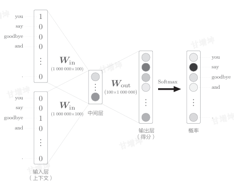
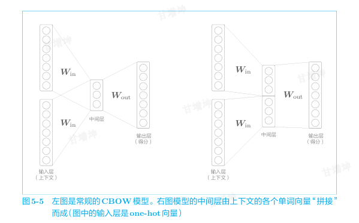
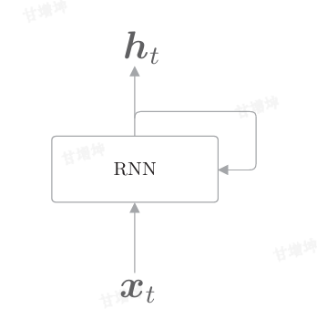
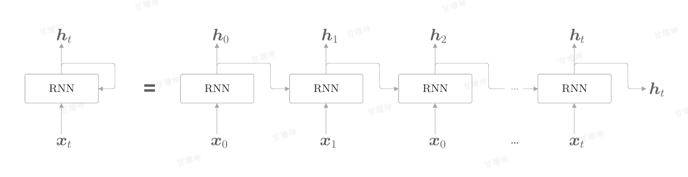
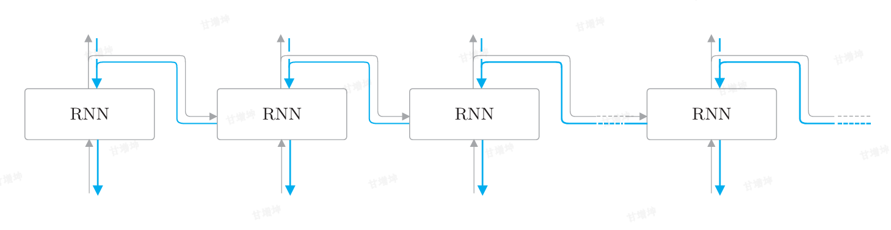
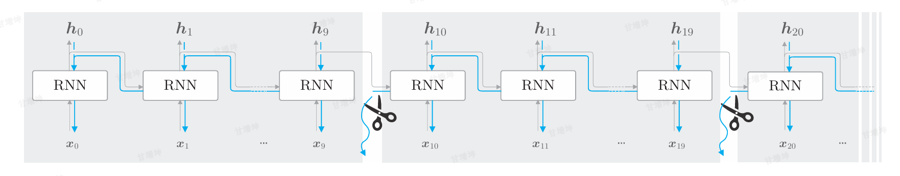
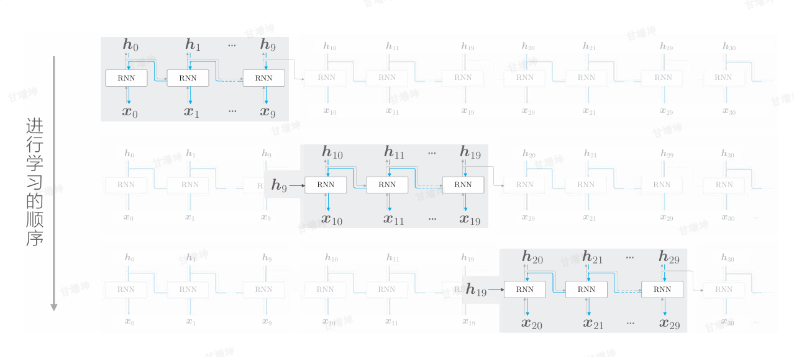
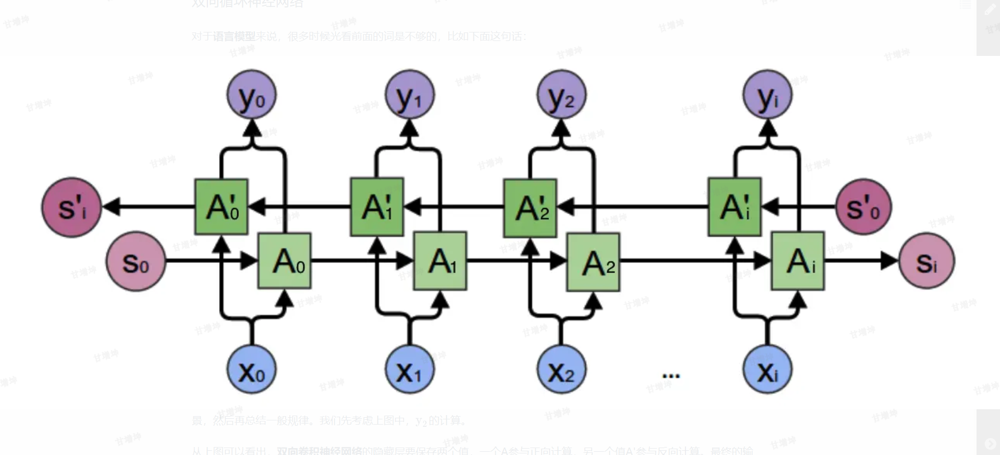
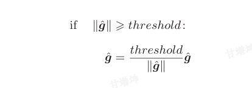

在开始前我们需要再重新理解一下人工智能、机器学习，深度学习的关系

其中人工智能是最大的范围，人工智能包括五个分支：
- 机器学习 (ML)：AI 的 "学习引擎"
- 自然语言处理 (NLP)：AI 的 "语言翻译官"
- 计算机视觉 (CV)：AI 的 "眼睛"
- 机器人学 (Robotics)：AI 的 "行动载体"
- 知识表示与推理：AI 的 "知识库与逻辑引擎"


## 自然语言和单词的分布式表示


### 自然语言处理

我们平常使用的语  言，称为**自然语言（natural language）**，而自然语言处理（Natural Language Processing，NLP），就是处理自然语言的科学。它是一种能够让计算机理解人类语言的技术。

**单词含义**
我们的语言是由文字构成的，而语言的含义是由单词构成的。换句话说，单词是含义的最小单位。因此，为了让计算机理解自然语言，让它理解单词含义可以说是最重要的事情了。


### 同义词词典

**同义词词典**是一种专门的工具书或数据库，其核心功能是**将含义相同或相近的词语系统地汇集在一起**。它不仅仅是简单罗列几个同义词，而是一个结构化的语言知识库。

在同义词词典中，具有相同含义的单词（同义词）或含义类似的单词（近义词）被归类到同一个组中。
_例如_：“**快乐**” 的词条下可能包含：**愉快、高兴、喜悦、欢快、兴奋、欢乐**等。

在自然语言处理中用到的同义词词典有时会定义单词之间的粒度更细的关系，比如“上位-下位(is-a)”关系、“整体-部分(part-of)”， “反义”关系。

 **WordNet** 是一个巨大的英语词汇数据库，它将单词按“同义词集”分组，并标注词性、定义，并建立了丰富的语义关系（如上下位关系、整体部分关系）。它已成为NLP研究的基础资源之一。

#### WordNet

**WordNet** 是自然语言处理领域最著名、最基础、使用最广泛的**计算词汇语义知识库**。你可以把它理解为一部为计算机设计的“超级同义词语义词典”。


#### 同义词词典的问题

- 1. **静态与不完备**：语言是活的，新词、新用法、网络用语层出不穷，传统词典难以实时更新。
- 2. **语境缺失**：词典给出的是脱离具体语境的“潜在”同义词，但一个词在特定句子中是否真的能被另一个词替换，完全取决于上下文。
- 3.**人力成本高**：制作词典需要巨大的人力成本。


### 基于计数的方法

**基于计数的方法** 是自然语言处理中，一类通过**大规模统计语料库中词汇的共现频率**来获取词汇语义表示（如词向量）的传统方法。它的核心思想非常简单直接：**“一个词的含义，可以由它周围经常出现的词（上下文）来定义。**

#### 分布式假设

**分布式假设** 的核心思想可以概括为一句话：

> **一个语言单位（如单词）的含义，是由它习惯性出现的上下文环境所决定的。**

- _例如_：“咖啡”和“茶”经常出现在类似的上下文里（如“喝”、“杯子”、“热”、“提神”），因此它们的含义向量在数学空间中也应该接近。


#### 共现矩阵


如上图所示，我们可以统计出每个单词出现频率（窗口为1），根据统计出来的数量来生成向量，比如：you单词的向量就是(0,1,0,0,0,0,0)，以此类推，生成矩阵就是：
$$
A = \begin{bmatrix}
0 & 1 & 0 & 0 & 0 & 0 & 0 \\ 
1 & 0 & 1 & 0 & 1 & 1 & 0 \\
0 & 1 & 0 & 1 & 0 & 0 & 0 \\
0 & 0 & 1 & 0 & 1 & 0 & 0 \\
0 & 1 & 0 & 1 & 0 & 0 & 0 \\
0 & 1 & 0 & 0 & 0 & 0 & 1\\
0 & 0 & 0 & 0 & 0 & 1 & 0 \\
\end{bmatrix}
$$
上面这个矩阵就是**共现矩阵**。其中里面的值代表的是**出现的次数**


#### 向量间的相似度

**向量间的相似度**，简而言之，就是**用数学方法量化两个向量在空间中的“接近”或“相似”程度**。它把抽象的“像不像”问题，变成了一个可计算的具体数值。

这个数值越高（在某些度量下是越低），通常表示两个向量所代表的对象（如词语、文档、图片特征）越相似。

**几何视角**

我们可以把向量想象成多维空间中的一个**箭头**或**点**。比较两个向量的相似度，就变成了比较这两个点/箭头的空间关系。

主要有两种比较视角：

1. **方向相似**：主要看两个箭头指向是否一致，忽略长度。（余弦相似度）
   
2. **距离接近**：主要看两个点之间的直线距离有多近。（欧氏距离，曼哈顿距离）

**余弦相似度**

计算两个向量夹角的余弦值。**只关注向量的方向，忽略其长度（模）**。

公式为：
$$
cos
$$


**值域**：**[-1, 1]**
- **1**： 方向完全相同（最相似）
  
- **0**： 正交，无关
  
- **-1**： 方向完全相反（最不相似）

### 基于计数的方法改进


#### 点互信息

**点互信息衡量的是两个具体事件（例如：两个特定的词同时出现）之间的关联强度。它回答的问题是：“当我们观察到其中一个事件时，能获得多少关于另一个事件发生的信息？”**

**一个直观的例子**： 
我们想知道“披萨”和“芝士”这两个词之间的关系。

- 如果“披萨”和“芝士”在文本中**一起出现的频率**，**远高于**它们各自独立出现频率的乘积（即如果它们是独立出现的预期频率），那么PMI值就会很高。这表明它们有很强的正相关。
  
- 如果它们一起出现的频率**接近**独立
  
- 如果它们一起出现的频率**低于**独立预期频率，PMI值会是负数。这表明它们之间存在一种“排斥”关系（但负PMI在实际中因噪音不太可靠，常被截断为0）。

**公式**

$$
PIM(x,y) = \log_2{\frac{P(x,y)}{P(x)P(y)}}
$$

其中：
- P(x)表示x发生的概率，在自然语言的例子中，P(x)就是指单词x在语料库中出现的概率。
	假设某个语料库中有10000个单词，其中单词the出现了100次，则P("the")= 100，P("the")=100/10000 =0.01。
- P(y)表示y发生的概率
	
- P(x,y)表示x和y同时发生的概率

**PMI的值越高，表明相关性越强**

我们上面讨论了共性矩阵，其中我们介绍了共性矩阵中的值是左右出现的次数，所以公式我们可以改写为：
$$
PIM(x,y) = \log_2{\frac{P(x,y)}{P(x)P(y)}} 
= \log_2{\frac{\frac{C(x,y)}{N}}{\frac{C(x)}{N}\frac{C(y)}{N}}}
= \log_2{\frac{C(x,y)·N}{C(x)C(y)}}
$$


虽然我们已经获得了PMI这样一个好的指标，但是PMI也有一个问题。 那就是当两个单词的共现次数为0时，$\log_{2}{0} = -∞$。为了解决这个问题， 实践上我们会使用下述正的点互信息（Positive PMI，PPMI）。
$$
PPMI(x, y) = max(0, PMI(x, y))
$$

当PMI是负数时，将其视为0，这样就可以将单词间的相关性表示为大于等于0的实数。现在我们可以将共性矩阵，转化为PPMI矩阵，

$$
PPMI = \begin{bmatrix}
0 & 1.807 & 0 & 0 & 0 & 0 & 0 \\ 
1.807 & 0 & 0.807 & 0 & 0.807 & 0.807 & 0 \\
0 & 0.807 & 0 & 1.807 & 0 & 0 & 0 \\
0 & 0 & 1.807 & 0 & 1.807 & 0 & 0 \\
0 & 0.807 & 0 & 1.807 & 0 & 0 & 0 \\
0 & 0.807 & 0 & 0 & 0 & 0 & 2.807\\
0 & 0 & 0 & 0 & 0 & 2.807 & 0 \\
\end{bmatrix}
$$

#### 降维

这个PPMI矩阵还是存在一个很大的问题，那就是随着语料库的词汇量增加，各个单词向量的维数也会增加。如果语料库的词汇量达到 10 万，则单词向量的维数也同样会达到10万。看一下这个矩阵，就会发现其中很多元素都是0（因为大部分词对从未共现）。这表明向量中的绝大多数元素并不重要，所以我们需要对这个矩阵进行降维，而降维使用的方法就是**奇异值分解**

**如何降维**


#### PTB数据集


## word2vec

**Word2Vec** 是一种广泛使用的**词嵌入**技术，由Google的研究团队在2013年提出。它的核心思想是：**将词语转换为计算机能理解的数值形式（即向量），并且让这些向量能够捕捉词语的语义和语法关系。**

**Word2Vec 本身并不直接进行推理**。它主要是一个**词表示学习工具**，但它学到的词向量确实能够**支持某些简单的类比推理任务**。

**两种主要模型架构**

1. **CBOW**
    - **原理**：用**上下文词语**（周围的词）来预测**中心词**。
      
    - **训练输入**：例如，对于句子 “The quick brown fox jumps”，如果中心词是 “fox”，上下文窗口为2，则输入是 [“The”, “quick”, “brown”, “jumps”]。
      
    - **特点**：训练速度较快，对高频词效果更好。
    
2. **Skip-gram**
    - **原理**：与CBOW相反，用**中心词**来预测其**上下文词语**。
    - **训练输入**：同样以 “fox” 为中心词，模型的任务是预测它周围的词 [“The”, “quick”, “brown”, “jumps”]。
    - **特点**：在处理低频词和表征复杂模式方面通常表现更好，尤其适用于大型数据集。


### 基于推理的方法和神经网络


#### 基于推理的方法

**基于推理的方法**，是指让机器像人类一样，**运用已有的知识（无论是明确给出的还是从数据中学到的），通过逻辑、因果或类比等思维过程，推导出新的结论、做出判断或解决问题**。

基于推理的方法的主要操作是“推理”，如何取推理，有以下几种路径：
- **基于符号的推理（传统AI，可解释性强）**
	这种方法模仿人类的逻辑思维，使用明确的符号和规则。
	将世界知识用形式化的符号系统表示出来。最常见的是**知识图谱**，用`（实体-关系-实体）`这样的三元组存储事实，例如 `（北京，是，中国首都）`、`（猫，属于，哺乳动物）`。然后编写逻辑规则，如`IF（A 是 B）AND（B 是 C）THEN（A 是 C）`（传递性规则）。
	当输入一个查询时（如“猫是动物吗？”），推理引擎会根据知识图谱中的事实和预先定义的规则，进行**逻辑演算、搜索或查询**，推导出答案。
-  **基于神经网络的推理（现代AI，灵活性高）**
	这种方法让模型从海量数据中**自动学习**潜在的推理模式和关联，而不需要人工显式地编写规则。
	使用强大的神经网络（尤其是**Transformer**）作为“计算引擎”。模型参数中隐式地存储了大量知识和关联模式。通过在“需要推理的数据”上进行训练，让模型学会推理。
	当输入一个问题时，模型通过复杂的非线性变换和注意力机制，在网络的“表示空间”中进行计算。这个计算过程可以被看作是一种**“向量的、隐式的推理”**。模型并非遵循显式逻辑，而是激活了与答案最相关的神经通路。
- **神经符号推理（前沿方向，追求兼备）**
	这是当前最受关注的前沿领域，旨在**结合神经网络的感知学习能力与符号系统的逻辑推理能力**，取长补短。

我们主要研究的是**基于神经网络的推理**。


#### 神经网络的单词处理

1. 首先，我们不能直接处理单词，所以我们先将词转化为向量（One-hot 编码），然后再通过神经网络，进一步处理，需要注意的是，我们现阶段还只是词的处理。
   
   > [!NOTE] 为什么不直接使用One-hot编码,，而是还要使用神经网络？
   >
   > 1.One-hot 编码无法表达
   >
   > 所有向量都是相互正交的（内积为 0）。这意味着，从数学上看，“国王”和“君主”的相似度，与“国王”和“苹果”的相似度**完全相同（都是0）**。这完全违背了我们的语言常识。
   >
   > 通过神经网络训练，语义相近的单词（如“国王”和“君主”）在向量空间中的**位置会非常接近**（余弦相似度高）。你可以计算向量距离来判断单词相似度。
   >
   > 2.维度灾难与计算效率
   >
   > 维度等于词汇表大小（V）。一个中等规模的语料库，V 可能达到 10 万或 100 万级。这意味着一个极其稀疏、维度极高的向量，会导致开销很大
   >
   > 神经网络可以将高维稀疏的 One-hot 向量映射到低维稠密的向量空间（例如 300 维）。这相当于进行了一次**智能的降维和特征提取**，将语义信息压缩到一个小而密集的向量中。比如
2. 输入神经元的数量为词汇数量。用One-hot 编码处理完之后的向量，都是只有一位是1，其他都是0的向量，比如：
   $$
   A = \begin{bmatrix}
   1 & 0 & 0 & 0 & 0 & 0 & 0 \\ 
   0 & 1 & 0 & 0 & 0 & 0 & 0 \\
   0 & 0 & 1 & 0 & 0 & 0 & 0 \\
   0 & 0 & 0 & 1 & 0 & 0 & 0 \\
   0 & 0 & 0 & 0 & 1 & 0 & 0 \\
   0 & 0 & 0 & 0 & 0 & 1 & 0 \\
   0 & 0 & 0 & 0 & 0 & 0 & 1 \\
   \end{bmatrix}
   $$
   然后神经元就是7个，当要输入第一个词汇是，第一个神经元输入1，其他神经元输入0，然后进行训练
   
3. 权重值，因为one-hot编码的向量，只有一个值为1，其他值为0，所以输入层和权重层矩阵乘积的时候，其实是取得是权重的对应行向量
   
   通常使用输入层的权重向量最为词向量


### CBOW


#### CBOW模型的推理

CBOW模型是根据上下文预测目标词的神经网络（“目标词”是指中间的单词，它周围的单词是“上下文”）。通过训练这个CBOW模型，使其能尽可能地进行正确的预测。CBOW 的**核心思想**是：**用一个词语的上下文（周围的词）来预测这个词语本身**。

下图是CBOW模型的网络。它有两个输入层，经过中间层到达输出层。这里，从输入层到中间层的变换由相同的全连接层（权重为Win）完成从中间层到输出层神经元的变换由另一个全连接层（权重为W_out）完成。


其中中间层，会将两个输入层的转化数据进行**求和**或**平均**，就上面的例子而言，经全连接层变换后，第1个输入层转化为h1，第2个输入层转化为h2，那么中间层的神经元是$\frac{h_1+h_2}{2}$ 

最后输出层，上图的输出层有7个神经元。这里重要的是，这些神经元对应于各个单词。输出层的神经元是各个单词的得分，它的值越大，说明对应单词的出现概率就越高。得分是指在被解释为概率之前的值，对这些得分应用Softmax函数，就可以得到概率。


#### CBOW模型的学习

CBOW（Continuous Bag-of-Words）的训练过程是一个**监督学习**过程，使用**神经网络**通过上下文预测中心词，从而学习到高质量的**词向量**。

这里我们处理的模型是一个进行多类别分类的神经网络。因此，对其进行学习只是使用一下Softmax函数和交叉熵误差。首先，使用Softmax函数将得分转化为概率，再求这些概率和监督标签之间的交叉熵误差，并将其作为损失进行学习，过程如下图：


> [!NOTE] CBOW训练每个单词都要训练吗？
> 每个单词都要训练，但是训练强度会有不同，像 “I”, “a”, “the” 这种高频词，在巨型语料库中会**出现成千上万次**，因此它们的向量会被更新非常多次。**但学到的语义信息少**，所以会有一些优化处理这些词，这些优化下面会说到


训练完成后，我们得到：
1. **输入矩阵 W**：每一行是一个词的词向量（通常使用这个）
2. **输出矩阵 W'**：每一列也可以看作词向量
实际应用中，常使用以下策略：
- 只使用W
- 使用W和W'的平均
- 使用W和W'的拼接

#### 写入数据准备


#### CBOW模型实现


### word2vec的补充说明

#### CBOW模型和概率


## word2vec改进

我们虽然实现了word2vec，但是还有很多需要完善的地方，比如单词库变成了一百万，那么就需要一百万的神经元，在如此多的神经元的情况下，中间的计算过程需要很长时间，具体来说是两个地方：

- 输入层的one-hot表示和权重矩阵Win的乘积
- 中间层和权重矩阵W_out的乘积以及Softmax层的计算

我们接下来根据这两个问题进行优化。


### Embedding层

#### 词嵌入

我们在上面处理单词的时候使用的one-hot编码将所有单词都转化为向量，然后转化为神经元输入，word2vec通过上下文来进行预测。如果语料库的词汇量有100万个，则单词的one-hot表示的维数也会是100万，我们需要计算这个巨大向量和权重矩阵的乘积。但是因为one-hot编码知识只有一位是1，其他位是0，所以与权重的乘积其实就是取权重的某一行，所以我们定义一层Embedding层，用来直接查表。

**Embedding层本质就是`V × D` 的权重矩阵W**，其中 `V` = 词汇表大小，`D` = 嵌入维度，前向传播就是简单的查表操作。我们不用再生成one-hot，我们直接根据单词id定义一组权重，然后去训练这些权重，最后得到词向量。

Embedding层只是用来存词向量的，并不参与训练


#### Embedding实现

**前向传播**

前向传播就是简单的

```python
import numpy as np

W = np.arange(21).reshape(7, 3)
W[2]

----------------------------------------
array([6, 7, 8])
```


### 负采样

**负采样**是Word2Vec训练中的一种**高效优化技术**，用于解决在大词汇表上计算softmax的**计算瓶颈**问题。

对于100万的单词，我们在中间层是通过100维处理，所以不会有太大问题，但是经过中间层之后，我们要到输出层，输出层我们又要输出100万神经元的输出，同时在计算概率的时候又是100万数据的计算，导致计算量特别大，如下图：



所以我们现在的优化方向就是优化这两块的计算量，我们使用负采样的技术来完成。


#### 负采样

负采样。这个方法的关键思想在于二分类（binary classification），更准确地说，是用二分类拟合多分类（multiclass classification），这是理解负采样的重点。

首先需要说明的是，整个word2vec的目的其实是生成词向量，所以我们不关心输出层，我们只关系输入层的权重，将输入层权重作为词向量。

现在我们来介绍一下**负采样**，**负采样就是从海量 “非目标样本”（负样本候选集）中随机挑选少量样本作为 “负样本”，与少量 “目标样本”（正样本）共同训练模型**，以替代 “遍历所有负样本” 的暴力方式，在保证模型效果的同时，大幅降低计算成本。将原来的判断概率，改成判断是否正确。

步骤：

1. 数据预处理：构建词汇表，并对单词进行索引。
   
2. 生成训练样本：滑动窗口扫描文本，生成（中心词，上下文词）的正样本对。
3. 负样本生成：对于每个正样本，随机采样K个负样本词（K通常为5-20）。
4. 模型训练：使用正负样本训练模型，通过优化损失函数来更新词向量。

```txt
原始文本：
    "我吃了一个苹果"
    ↓
索引化：
    [我, 吃, 了, 一个, 苹果] → [3, 1, 5, 4, 0]
    ↓
滑动窗口（窗口大小=2）：
    中心词在位置4："苹果"(0)
    上下文窗口：位置2-4：[了(5), 一个(4)]
    生成正样本：(苹果(0), 了(5))
    ↓
负采样（K=3）：
    从噪声分布采样：香蕉(2), 跑步(8), 电脑(9)
    ↓
训练样本：
    中心词: 0 (苹果)
    正样本: 5 (了)
    负样本: [2, 8, 9] (香蕉, 跑步, 电脑)
    ↓
模型训练：
    1. 取向量：v_苹果, u_了, u_香蕉, u_跑步, u_电脑
    2. 计算：σ(v_苹果·u_了) 应该接近1
               σ(-v_苹果·u_香蕉) 应该接近1
               σ(-v_苹果·u_跑步) 应该接近1
               σ(-v_苹果·u_电脑) 应该接近1
    3. 更新这5个词的向量
```

从上面来看，我们其实没有真正的输出层，我们每次只是训练几个样本，更新这几个样本的权重，因为我们只关注输入层的权重，输出层对我们来说没有意义。经过这一系列的操作，最终得到了词向量。

每次使用正样本和负样本去训练，就会使相关的词聚合，而不相关的词会远离。

> [!NOTE] 为什么只是采用几个负样本？
>
> 1.考虑到效率，如果使用全部词汇表作为负样本，那么每次更新都需要计算所有词的梯度并更新它们的向量，这在大词汇表上计算成本极高。
>
> 2.每一个词都会训练，所以一个词跟另一个词不相关，而另一个与第二个词相关，最后的向量会显示第一个词和第三个词不相关

#### 损失函数

损失函数我们使用的是二分类的交叉熵误差函数，公式为：
$$
L =−(t\log{y} +(1−t)\log{(1−y)})
$$
y是经过中间层的输出，t是正确解标签，取值为0或1：取值为1时，表示正确解，输出为$−\log{y}$；当t为0时，输出$−\log{(1−y)}$。所以当取值为1的时候，y越趋向于1的时候，误差越小，当t取值为0的时候，y越趋向于0的时候，误差越小。

> ### 为什么负采样能学习到语义？
>
> 当模型看到：
>
> - (吃, 鱼)是正样本 → 把"吃"和"鱼"的向量拉近
> - (吃, 跑步)是负样本 → 把"吃"和"跑步"的向量推远
> - (吃, 电脑)是负样本 → 把"吃"和"电脑"的向量推远
>
> 经过大量这样的训练：
> - 食物相关的词（鱼、肉、面包）会聚集在一起
> - 运动相关的词（跑步、游泳、跳跃）会聚集在一起
> - 这两类词会在向量空间中分开


#### 负采样的采样方法

我们知道了负采样是如何工作的，现在我们来看一下是如何进行采样负样本的，在word2vec中，一般使用的采样方法是**按词频加权采样**，根据单词出现的次数作为概率进行采样，但是为了是低频词更容易采样，我们将对原来的概率分P布的各个元素取0.75次方。不过，为了使变换后的概率总和仍为1，分母需要变成“变换后的概率分布的总和”。
$$
P^\prime(w_i)=\frac{P(w_i)^{0.75}}{\sum_{j}^{n}P(w_j)^{0.75}}
$$

```python
import numpy as np

p = [0.7, 0.29, 0.01]
new_p = np.power(p, 0.75)
new_p /= np.sum(new_p)
print(new_p)

---------------------------------
[0.64196878 0.33150408 0.02652714]
```

通过上面的代码可以看出，经过0.75次幂之后，低频的数据的概率增加了。

> [!NOTE] 为什么是0.75
>
> 0.75是经过大量实验得到的。
>
> | 幂次 | 效果       | 说明                               |
> | :--- | :--------- | :--------------------------------- |
> | 0.5  | 过于激进   | 高频词概率降得太低，低频词过于频繁 |
> | 0.75 | 最佳平衡点 | 高频词仍有机会，低频词得到提升     |
> | 1.0  | 无调整     | 高频词主导，效果差                 |
> | >1.0 | 反向调整   | 高频词概率反而增加，更差           |


#### 负采样的实现


## RNN

到目前为止，我们看到的都是前馈型神经网络（FNN）。前馈（feedforward）是指网络的传播方向是单向的。具体地说，先将输入信号传给下一层（隐藏层），接收到信号的层也同样传给下一层，然后再传给下一层……像这样，信号仅在一个方向上传播。就是往后传播，传播的输出层就算结束。

虽然前馈网络结构简单、易于理解，但是可以应用于许多任务中。不过，这种网络存在一个大问题，就是不能很好地处理时间序列数据。更确切地说，单纯的前馈网络无法充分学习时序数据的性质。于是，RNN（Recurrent Neural Network，循环神经网络）便应运而生

> [!NOTE] 序列数据
> 是指**数据点之间存在明确的顺序或依赖关系**的数据集。改变这个顺序，数据的意义就会被破坏或完全改变，比如`“猫追老鼠”` 和 `“老鼠追猫”` 意思完全不同。
>
> **时间序列数据是序列数据的一个最重要、最普遍的子集。** 它的特点是，数据点之间的顺序是由**时间**这一物理维度来定义的。按**时间顺序**索引、记录的一系列数据点。通常是**在连续或离散的时间点上对某个指标进行观测的结果**。比如：每分钟股价、每日汇率、季度GDP、智能电表每小时用电量、工厂传感器每秒的温度和压力读数。


### 语言模型

**语言模型的核心是学习语言的规律，并预测给定文本序列的可能性。**

语言模型（language model）给出了单词序列发生的概率。具体来说，就是使用概率来评估一个单词序列发生的可能性，即在多大程度上是自然的单词序列。例如：“今天天气很好”的概率会远高于“今天天气很哈”。

**核心任务：预测下一个词**


#### 概率视角下的word2vec

上面我们学习的CBOW模型所做的事情就是从上下文（$w_{t−1}$和$w_{t+1}$）预测目标词（$w_t$）。 “当给定$w_{t−1}$和$w_{t+1}$时，目标词是$w_t$的概率”：
$$
P(w_t|w_{t-1},w_{t+1})
$$
这是窗口大小为1时的CBOW模型，并且是左右对称的，现在我们将上下文限定为左侧窗口，将左侧2个单词作为上下文的情况下，CBOW模型输出的概率如下：
$$
P(w_t|w_{t-2},w_{t-1})
$$
意思是在给定前面两个词时，目标词是$w_t$的概率。


#### 语言模型

语言模型可以应用于多种应用，典型的例子有机器翻译和语音识别。比如，语音识别系统会根据人的发言生成多个句子作为候选。此时，使用语言模型，可以按照“作为句子是否自然”这一基准对候选句子进行排序。例如，语音识别中，“今天天气很好”的概率会远高于“今天天气很哈”，从而帮助系统选择正确的识别结果。

语言模型也可以用于生成新的句子。因为语言模型可以使用概率来评价单词序列的自然程度，所以它可以根据这一概率分布造出（采样）单词。

给定一个由*m* 个词组成的序列$W=(w_1,w_2,...,w_m)$，语言模型的目标是计算这个序列出现的联合概率（多个事件一起发生的概率）：
$$
P(W) 
= P(w_1,w_2,w_3,...,w_m)
=P(w_1) \cdot P(w_2 | w_1) \cdot P(w_3 | w_1, w_2) \cdot ... \cdot P(w_m | w_1, w_2, ..., w_{m-1})
$$

- **这个分解在语言上非常直观：**
  *   \( P(w_1) \)：第一个词 \( w_1 \) 出现的概率。
  *   \( P(w_2 | w_1) \)：在已知第一个词是 \( w_1 \) 的前提下，第二个词 \( w_2 \) 出现的概率。
  *   \( P(w_3 | w_1, w_2) \)：在已知前两个词是 \( w_1, w_2 \) 的前提下，第三个词 \( w_3 \) 出现的概率。
  *   ... 以此类推。

**这个概率越高，说明这个句子越通顺、越常见、越“像人话”。** **语言模型的核心任务，就是准确地估计这些条件概率。**


#### CBOW模型

我们上面说了CBOW模型可以根据指定上下文预测目标值，那是否可以用CBOW模型来作为语言模型。答案是**不行的**，因为CBOW将上下文视为一个“词袋”，没有上下文的单词顺序，比如对于【`say`,`you`】和【`you`,`say`】会被作为相同的内容进行处理（因为CBOW模型的中间层求单词向量的和），但是意思是不同的。

当然可以在中间层“拼接”（concatenate）上下文的单词向量。实际上，“Neural Probabilistic Language Model”中提出的模型就采用了这个方法。但是，如果采用拼接的方法，权重参数的数量将与上下文大小成比例地增加。



如何解决这里提出的问题呢？这就轮到RNN出场了。RNN具有一个机制，那就是无论上下文有多长，都能将上下文信息记住。因此，使用RNN可以处理任意长度的时序数据。


### RNN

> 主要基于https://zybuluo.com/hanbingtao/note/541458

RNN（Recurrent Neural Network）中的Recurrent源自拉丁语，意思是“反复发生”，可以翻译为“重复发生”“周期性地发生“循环”，因此RNN可以直译为“复发神经网络”或者“循环神经网络”。

> Recurrent Neural Network通常译为“循环神经网络”。另外， 还有一种被称为Recursive Neural Network（递归神经网络）的 网络。这个网络主要用于处理树结构的数据，和循环神经网络不是一个东西。

RNN与之前的神经网络的区别：

> 之前学的神经网络，每次只是处理当前的数据，当前的数据输入，到的输出，然后反向传播更新权重值，这是一次训练，但是这次训练只是根据当前输入，跟其他的输入是没关系的。如果训练数据是在同一个序列，那么每次一的训练相互不关联。
>
> 但是RNN会记录序列中的每一次的训练，并且之前的每一次训练都参与当前的训练。

#### RNN结构

现在我们来看一下RNN的结构：



里面有一个循环的结构，现在我们把循环结构展开：



可以看出，各个时刻的RNN层接收传给该层的输入和前一个RNN层的输出，然后据此计算当前时刻的输出，此时进行的计算可以用下式表示：
$$
h_t=tanh(h_{t-1}W_h+x_tW_x+b)
$$
RNN有两个权重，分别是将输入x转化为输出h的权重$W_x$和将前一个RNN层的输出转化为当前时刻的输出的权重$W_h$。此外，还有偏置b。这里，$h_{t−1}$和$x_t$都是行向量。其中这两个权重是共用一套。tanh函数是双曲正切函数，是激活函数。

> 比如，`小明 昨天 上学 迟到 了 ，老师 批评 了 ____。`,如果使用前面的word2Vec预测下一个词，我们只会看到`批评`和`了`这两个词，很难会预测到小明这个词。所以RNN里面的$W_h$保存到都是之前的隐藏状态，用于处理序列数据


#### Backpropagation Through Time（BPTT）

我们已经知道了正向传播，我们再来看一下反向传播，



将循环展开后的RNN可以使用（常规的）误差反向传播法。换句话说，可以通过先进行正向传播，再进行反向传播的方式求目标梯度。因为这里的误差反向传播法是“按时间顺序展开的神经网络的误差反向传播法”，所以称为Backpropagation Through Time（基于时间的反向传播），简称BPTT。

接下来我们先把上面的公式展开：
$$
\begin{aligned}
h_t &= tanh(h_{t-1}W_h+x_tW_x+b_t)\\
    &= tanh((tanh(h_{t-2}W_h+x_{t-1}W_{x-1}+b))W_h+x_tW_x+b_{t-1}) \\
    &=...\\
y2 &= W_yy × h_t + b_y \\
L &= (y2 - target)²
\end{aligned}
$$
其中ht是隐藏层的输出，我们要得到最终的输出，我们还要经过输出层。我们可以看出$W_h$受到上一时刻的影响，也就是说我们对$W_h$计算梯度，分为多个地方，一个是当前时刻的数据（即$x_tW_x$），一个是上一时刻的数据（即$x_{t-1}W_{t-1}$），而上一时刻的路径又受到上上时刻是数据。根据链式法则：如果一个参数在**多个地方**影响损失，那么它对损失的总影响是**所有影响的叠加**。
$$
\frac{∂L}{∂W_{hh}} = Σ_{t=1}^{T} \frac{∂L}{∂h_t} * \frac{∂h_t}{∂W_{hh}}
$$

> [!NOTE] 让我们看一个只有2个时间步的RNN：
>
> ```
> 时间步1: h1 = tanh(W_xh × x1 + W_hh × h0 + b_h)
> 时间步2: h2 = tanh(W_xh × x2 + W_hh × h1 + b_h)
> 输出: y2 = W_hy × h2 + b_y （一般还有激活函数，这里面直接去掉，方便分析）
> 损失: L = (y2 - target)²
> ```
>
> W_hh 在两个时间步都用了，所以计算 $\frac{∂L}{∂W_{hh}}$，分为两部分，一部分是$h_2$对$W_{hh}$的导数，另一部分是$h_2$对$h_1$的导数，然后$h_1$对$W_{hh}$的导数
> $$
 \frac{∂L}{∂W_{hh}} = \frac{∂L}{∂y^2} * \frac{∂y^2}{∂h_2} * \frac{∂h_2}{∂W_{hh}} + \frac{∂L}{∂y^2} * \frac{∂y^2}{∂h_2} * \frac{∂h_2}{∂h_1} * \frac{∂h_1}{∂W_{hh}}
 $$

$$$$

#### Truncated BPTT

通过上面的的推导公式，我们可以发现，如果序列数据太长会导致梯度传播不稳，导致梯度消失和爆炸，而且太长会导致训练时间慢。占用更多的内存空间。

所以在处理长时序数据时，通常的做法是将网络连接截成适当的长度。具体来说，就是将时间轴方向上过长的网络在合适的位置进行截断，从而创建多个小型网络，然后对截出来的小型网络执行误差反向传播法，这个方法称为Truncated BPTT（截断的BPTT）。在Truncated BPTT 中，网络连接被截断，但严格地讲，只是网络的反向传播的连接被截断，正向传播的连接依然被维持。



我们截断了反向传播的连接，以使学习可以以10个RNN层为单位进行。像这样，只要将反向传播的连接截断，就不需要再考虑块范围以外的数据了，因此可以以各个块为单位（和其他块没有关联）完成误差反向传播法。



#### 双向循环神经网络网络

对于**语言模型**来说，很多时候光看前面的词是不够的，比如下面这句话：

> 我的手机坏了，我打算____一部新手机。

如果我们只看前面的句子`我的手机坏了，我打算`，中间的空格可能是`换`、`修`，或者`大哭一场`，这些都是可以的，但是如果我们从后往前看，我们可以很明显应该是`换`这个词。所以双向循环神经网络就诞生了



正向计算和反向计算**不共享权重**


## RNN改进

### RNN的问题


#### 梯度爆炸和梯度消失

我们看一下公式：
$$
\begin{aligned}
h_t &= tanh(h_{t-1}W_h+x_tW_x+b_t)\\
    &= tanh((tanh(h_{t-2}W_h+x_{t-1}W_{x-1}+b))W_h+x_tW_x+b_{t-1}) \\
    &=...
\end{aligned}
$$


可以看到我们在计算h_t的时候，W_h被乘了t次，如果W_h是标量，当Wh大于1时，梯度呈指数级增加；当W_h小于1时，梯度呈指数级减小。那么，如果Wh不是标量，而是矩阵呢？此时，矩阵的奇异值将成为指标。简单而言，矩阵的奇异值表示数据的离散程度。根据这个奇异值（更准确地说是多个奇异值中的最大值）是否大于1，可以预测梯度大小的变化。

> 如果奇异值的最大值大于1，则可以预测梯度很有可能会呈指数级增加；而如果奇异值的最大值小于1，则可以判断梯度会呈指数级减小。但是，并不是说奇异值比1大就一定会出现梯度爆炸。也就是说，这是必要条件，并非充分条件。
>
>  Pascanu, Razvan, Tomas Mikolov, Yoshua Bengio.On the difficulty  of training recurrent neural networks[J]. International Conference on  Machine Learning, 2013. 这篇文献详细探讨了RNN的梯度消失和梯度爆炸问题。
>
> **数学角度：**# 奇异值分解
>
> 设权重矩阵 *W* 的奇异值分解为 $W=UΣV^T$ ，其中 Σ 是对角矩阵，对角线元素为奇异值 σ1≥σ2≥...≥σn≥0。当连乘 *n* 次时：
> $$
> W^n = (UΣV^T)^n = UΣ^nV^T
> $$
> 其中 $Σ^n$ 的对角线元素为 $σ_1^n,σ_2^n,...,σ_n^n$。
>
> **关键结论**：
>
> - 如果 σ1>1，则 $σ_1^n$ 随 *n* **指数增长** → 梯度爆炸
> - 如果 σ1<1，则 $σ_1^n$ 随 *n* **指数衰减** → 梯度消失
>
> 为什么要取奇异值最大值与1比较？


#### 梯度爆炸的对策

解决梯度爆炸有既定的方法，称为**梯度裁剪（gradients clipping）**。

**实现方式：**

- **按值裁剪（Clip by Value）**：将梯度限制在[-threshold, threshold]之间。
- **按范数裁剪（Clip by Norm）**：当梯度的范数超过阈值时，将梯度按比例缩放，使其范数等于阈值。

现在我们探讨一下按L2范数裁剪，我们将阈值设置为*threshold*，如果L2范数的值大于等于阈值，那么就修正梯度。其中计算的是总梯度的L2范数，总梯度包括反向传播中所有计算出来的梯度，将其**拼接**到一起，然后计算范数，代码如下：



就按上述方法修正梯度，这就是梯度裁剪。

> [!NOTE] **梯度如何拼接**
>
> 其实就是将所有的梯度，拉成一维，然后拼接成一个超长的一维数据，然后再进行裁剪。
>
> #### **关键性质**
>
> 1. **保方向性**：裁剪是**等比例缩放**，不改变梯度方向
> 2. **全局一致性**：所有梯度**按相同比例缩放**

还有其他方法：

- **权重正则化（Weight Regularization）**

  常用方法：

  - **L2正则化（权重衰减）**：惩罚大的权重，使权重趋向于较小的值。
  - **L1正则化**：也可以用于稀疏化权重。

- **使用门控机制（Gated Mechanisms）**

  使用LSTM、GRU等门控循环单元，它们通过门控机制控制信息的流动，从而缓解梯度消失和爆炸。

- **权重初始化技巧（Weight Initialization）**

  常用方法

  - **Xavier初始化**：适用于tanh激活函数，使每一层的输出方差尽可能相等。
  - **He初始化**：适用于ReLU激活函数。


### 梯度消失和LSTM

在RNN的学习中，梯度消失也是一个大问题。为了解决这个问题，需要从根本上改变RNN层的结构，这里本章的主题Gated RNN就要登场了。

> [!INFO] 阿萨大大
> 

#### LSTM的接口

先来看一下，普通RNN和LSTM的区别：


我们可以发现几点区别：
- LSTM增加了一个$c_{t-1}和$$c_t$两个参数；
- 这两个参数只在内部传输，不输出到其他外部层，不像$h_t$它输出（向上）到其他层。

我们将$c_t$叫做为`记忆单元`或者为`单元`。

> [!NOTE] 从接收LSTM的输出的一侧来看，LSTM的输出仅有隐藏状态向量h。 记忆单元c对外部不可见，我们甚至不用考虑它的存在。


#### LSTM层的结构

刚才我们看到了，LSTM有记忆单元$c_t$,这个记忆单元存储了时刻t时LSTM的记忆，可以认为其中保存了从过去到时刻t的所有必要信息（或者以此为目的进行了学习），然后，基于这个记忆单元，输出隐藏状态$h_t$。


如上图所见，上一层的$c_{t-1}$和$h_{t-1}$以及$x_1$经过某种计算得到了$c_t$，然后经过激活函数tanh得到$h_t$


#### 输出门

隐藏状态$h_t$对记忆单元$c_t$仅仅应用了tanh函数。这里考虑对$tanh(c_t)$施加门。换句话说， 针对$tanh(c_t)$ 的各个元素，调整它们作为下一时刻的隐藏状态的重要程度。由于这个门管理下一个隐藏状态ht的输出，所以称为输出门（output gate）

> [!NOTE] Gate
> 
> Gate是“门” 的意思，就像将门打开或合上一样，控制数据的流动。
> 
> LSTM中使用的门并非只能“开或合”，还可以根据将门打开多少来控制水的流量。比如控制70%或者20%，门的开合程度由0.0~1.0的实数表示（1.0为全开），通过这个数值控制流出的水量。这里的重点是，门的开合程度也是（自动）从数据中学习到的。
> 
> 有专门的权重参数用于控制门的开合程度，这些权重参数通过学习被更新。另外，sigmoid函数用于求门的开合程度（sigmoid函数的输出范围在0.0~1.0）。

输出门的开合程度（流出比例）根据输入$x_t$和上一个状态$h_{t-1}$求出。这里在使用的权重参数和偏置的上标上添加了output的首字母o。之后，我们也将使用上标表示门。另外，sigmoid 函数用σ()表示。

$$
o = \sigma{(x_tW_x^{(o)} + h_{t-1}W_h^{(o)} + b^{(o)})}
$$

根据上面的式子，我们看到$x_t$的输出门权重$W_x^{(o)}$，上一时刻$h_{t-1}$的输出门权重（$x_t$和$h_{t−1}$是行向量）,然后将它们的矩阵乘积和$b^{(o)}$之和传给sigmoid 函数，结果就是输出门的输出o。最后，将这个o和tanh(ct)的对应元素的乘积作为ht输出。


在图6-15中，将输出门进行的式(6.1)的计算表示为σ。然后，将它的输出表示为o，则ht可由o和tanh(ct)的乘积计算出来。这里说的“乘积”是对应元素的乘积，也称为阿达玛乘积。如果用表示阿达玛乘积，则此处的计算如下所示：
$$
h_t = o \odot tanh(c_t)
$$
> [!INFO] 
> tanh的输出是−1.0 ~ 1.0的实数。我们可以认为这个−1.0~1.0的数值表示某种被编码的“信息”的强弱（程度）。而sigmoid函数的输出是0.0~1.0的实数，表示数据流出的比例。因此，在大多数情况下，门使用sigmoid函数作为激活函数，而包含实质信息的数据则使用tanh函数作为激活函数。
> 
> 另外，输出门的权重是单独的，不只输出门，接下来其他门也是有单独的权重，都要去训练


#### 遗忘门

我们在记忆单元ct−1上添加一个忘记不必要记忆的门，这里称为遗忘门（forget gate），用来决定从上一时刻的细胞状态 $c_{t-1}$ 里保留多少、忘掉多少。
$$
f = \sigma{(x_tW_x^{(f)} + h_{t-1}W_h^{(f)} + b^{(f)})}
$$


#### 候选细胞

添加完遗忘门。我们还需要将当前的状态添加到$c_t$中，这里称作`候选细胞`，候选细胞（也叫“候选细胞状态”）指的是 LSTM 里还没被输入门筛选之前的“新信息”，
$$
g = tanh(x_tW_x^{(g)} + h_{t-1}W_h^{(g)} + b^{(g)})
$$
这里用g表示向记忆单元添加的新信息。通过将这个g加到上一时刻的$c_{t-1}$上，从而形成新的记忆。


#### 输入门

最后我们需要增加一个`输入门`，在 0～1 之间，决定从候选细胞里取多少写进细胞状态。


输入门判断新增信息g的各个元素的价值有多大。输入门不会不经考虑就添加新信息，而是会对要添加的信息进行取舍。换句话说，输入门会添加加权后的新信息。

用σ表示输入门，用i表示输出，此时进行的计算如下：
$$
i = \sigma{(x_tW_x^{(i)} + h_{t-1}W_h^{(i)} + b^{(i)})}
$$
然后，将i和g的对应元素的乘积添加到记忆单元中。
$$
c_t = f_t\odot{c_{t-1}} + i_t\odot{g}
$$
然后输出$h_t$
$$
h_t = o \odot tanh(c_t)
$$

#### LSTM的优点

LSTM为什么会防止梯度消失？

再来回顾一下RNN为什么会梯度消失，因为


### GRU


## 基于RNN生成文本


### 使用语言模型生成文本

我们介绍完RNN以及变体LSTM，我们来看一下，如何使用去生成文本，我们以‘you say goobye and i say hello.’为例，我们在训练完成的模型下，看一下是如何输出文本的

### seq2seq模型


#### seq2seq的原理

seq2seq 模型也称为Encoder-Decoder 模型。顾名思义，这个模型有两个模块——Encoder（编码器）和Decoder（解码器）。编码器对输入数据进行编码，解码器对被编码的数据进行解码。

> [!INFO] 编码是基于某些既定规则的信息转换过程。以字符码为例，将字符“A”转换为“1000001”（二进制）就是一个编码的例子。而解码则将被编码的信息还原到它的原始形态。仍以字符码为例，这相当于将位模式的“1000001”转换为字符“A”。


编码器首先对“吾輩は猫である”这句话进行编码，然后将编码好的信息传递给解码器，由解码器生成目标文本。此时，编码器编码的信息浓缩了翻译所必需的信息，解码器基于这个浓缩的信息生成目标文本。


由上图可以发现，编码器利用RNN将时序数据转换为隐藏状态h。编码器输出的向量h是LSTM层的最后一个隐藏状态，其中编码了翻译输入文本所需的信息。这里的重点是，LSTM的隐藏状态h是一个固定长度的向量。说到底，编码就是将任意长度的文本转换为一个固定长度的向量

**解码器**


由上图可以看出，解码器的结构和上一节的神经网络完全相同。不过它和上一节的模型存在一点差异，就是LSTM层会接收向量h。在上一节的语言模型中，LSTM层不接收任何信息。这个唯一的、微小的改变使得普通的语言模型进化为可以驾驭翻译的解码器。

还有一点，前一时刻的输出是当前时刻的输入。比如第一次生成的`I`，然后下一时刻输入就是`I`，然后LSTM内部之间的h还是按照之前的方式传输

> [!INFO] 上图使用了这一分隔符（特殊符号）。这个分隔符被用作通知解码器开始生成文本的信号。另外，解码器采样到出现为止，所以它也是结束信号。也就是说，分隔符可以用来指示解码器的“开始/结束”。在其他文献中，也有使用、或 者“_”（下划线）作为分隔符的例子。

最终seq2seq完整结果如下：


seq2seq由两个LSTM层构成，即编码器的LSTM和解码器的LSTM。此时，LSTM层的隐藏状态是编码器和解码器的“桥梁”。在正向传播时，编码器的编码信息通过LSTM层的隐藏状态传递给解码器；在反向传播时，解码器的梯度通过这个“桥梁”传递给编码器。

**简单seq2seq效果**


### seq2seq改进


#### 反转输入数据（Reverse）

这里的 Reverse 常指 「把源语言句子反着输入」（reverse source / reversed input）：

- 做法：编码器读的不是「A B C D」，而是「D C B A」。

- 原因（经典论文里的发现）：反着输入时，目标语言第一个词要预测的源语信息在时间上更「近」，短期依赖更明显，有时训练更稳定、效果更好。

- 现在很多模型用 Transformer + 注意力，不一定要用这个 trick，但在 LSTM/RNN 时代的 Seq2Seq 里很常见。

**效果**


#### 偷窥（Peeky）

Peeky（或 peeking）在 Seq2Seq 里指的是：解码器在每一个时间步都“偷看”编码器的输出（上下文向量 h），而不是只在开头用一次。

编码器将输入语句转换为固定长度的向量h，这个h集中了解码器所需的全部信息。也就是说，它是解码器唯一的信息源。将这个集中了重要信息的编码器的输出h分配给解码器的其他层。


如上层将编码器的输出h分配给所有时刻的Affine层和LSTM层。在LSTM输入层也是案几上了h

> [!INFO] 这里的改进是将编码好的信息分配给解码器的其他层，这可以解释为其他层也能“偷窥”到编码信息。因为“偷窥”的英语是peek，所以将这个改进了的解码器称为Peeky Decoder。同理，将使用了 Peeky Decoder的seq2seq称为Peeky seq2seq。

有两个向量同时被输入到了LSTM层和Affine层，这实际上表示两个向量的拼接（concatenate）


效果：


### seq2seq的应用

#### 聊天机器人


#### 自动图像描述

除了文本之外，seq2seq 还可以处理图像、语音等类型的数据。我们来看一下将图像转换为文本的自动图像描述（image captioning）。


它和之前的网络的唯一区别在于，编码器从LSTM换成了CNN（Convolutional Neural Network，卷积神经网络），而解码器仍使用与之前相同的网络。仅通过这点改变（用CNN替代LSTM）， seq2seq就可以处理图像了。

这里补充说明一下图中的CNN。此处，CNN对图像进行编码，这时CNN的最终输出是特征图。因为特征图是三维（高、宽、通道）的，所以需要想一些办法让解码器的LSTM可以处理它。于是，我们将CNN的特征图扁平化到一维，并基于全连接的Affine层进行转换。之后，再将转换后的数据传递给解码器，就可以像之前一样生成文本了。

> [!NOTE] 当前大模型结构
> 按「结构」来说：多数大模型不是经典 Seq2Seq
> 经典 Seq2Seq = Encoder–Decoder 两段式：
> - 一个 Encoder 只读输入
> - 一个 Decoder 在 Encoder 的表示上生成输出
> 
> 例如：做翻译时的原始 Transformer、T5、BART、MarianMT 等
> 
> 而现在绝大多数「大模型」（GPT、LLaMA、Qwen、Mistral、ChatGLM 等）是 Decoder-only：
> - 没有单独的 Encoder
> - 只有一层层 Decoder（带因果掩码的 Transformer）
> - 输入、输出都在同一条序列上：前面是 prompt，后面接着自回归生成
> 
> 所以从架构上讲：现在主流大模型是「纯 Decoder」结构，不是 Encoder–Decoder 那种 Seq2Seq 结构。


## Attention

seq2seq实现方式

| 实现               | 说明                                                                    |
| ---------------- | --------------------------------------------------------------------- |
| RNN/LSTM Seq2Seq | Encoder、Decoder 都用 RNN/LSTM；cc 通常是 Encoder 最后时刻的隐藏状态。                 |
| + Attention      | Decoder 每一步不只用一个固定的 cc，而是对 Encoder 所有时间步做加权（注意力），缓解“长序列信息挤在一个向量里”的问题。 |
| Transformer      | Encoder 和 Decoder 都改用自注意力，没有 RNN；仍是“编码器读输入、解码器生成输出”的 Seq2Seq 思想。      |

所以：Seq2Seq 是“任务形态”（序列→序列），Encoder–Decoder 是“结构形态”，RNN/Transformer 等是具体实现。

我们介绍完了第一种RNN/LSTM Seq2Seq，我们现在介绍第二种。

### Attention的结构

#### seq2seq的问题

我们回看一下seq2seq结构：


seq2seq 中使用编码器对时序数据进行编码，然后将编码信息传递给解码器。此时，编码器的输出是固定长度的向量。这就存在一个问题，固定长度的向量意味着，无论输入语句的长度如何（无论多长），都会被转换为长度相同的向量。不管输入的文本如何，都需要将其塞入一个固定长度的向量中。

#### 编码器的改进

基于上面的问题，我们改进一下编码器。我们不再只是用最后的隐藏状态h，而是每个时刻隐藏状态我们都使用，使用各个时刻（各个单词）的隐藏状态向量，可以获得和输入的单词数相同数量的向量。这样一来，编码器就摆脱了“一个固定长度的向量”的制约。


各 个时刻的隐藏状态中包含了大量当前时刻的输入单词的信息。如上图，输入“猫”时的LSTM层的输出（隐藏状态）受此时输入的单词“猫”的影响最大。因此，可以认为这个隐藏状态向量蕴含许多“猫的成分”。编码器输出的hs矩阵就可以视为各 个单词对应的向量集合。


#### 解码器的改进

我们上面说了编码器的改进，编码器不再单独输出最后的隐藏状态，而是整体输出各个单词对应的LSTM层的隐藏状态向量hs。然后，这个hs被传递给解码器，以进行时间序列的转换。所以我们需要改以一下解码器，使它支持接收和处理整个hs。

我们期望的是

在介绍Attention之前，我们先看一下整体的结构：


如上图所示，我们增加了一层计算，用来接收（解码器）各个时刻的LSTM层的隐藏状态和编码器的hs。然后，从中选出必要的信息，并输出到Affine层。与之前一样，编码器的最后的隐藏状态向量传递给解码器最初的LSTM层。