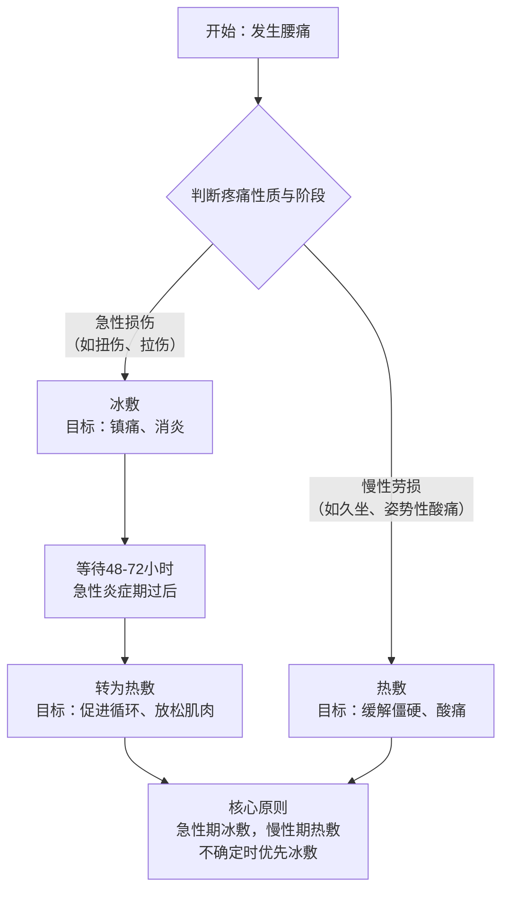

https://blog.csdn.net/weixin_42546496/article/details/88115095

## 数学公式表示法

$$
A = \begin{matrix}1 & 2 & 3 \\4 & 5 & 6 \\7 & 8 & 9\end{matrix}
+ \begin{bmatrix}1 & 2 & 3 \\4 & 5 & 6 \\7 & 8 & 9\end{bmatrix}
+ \begin{vmatrix}1 & 2 & 3 \\4 & 5 & 6 \\7 & 8 & 9\end{vmatrix}
+ \begin{pmatrix}1 & 2 & 3 \\4 & 5 & 6 \\7 & 8 & 9\end{pmatrix}
+ \begin{Bmatrix}1 & 2 & 3 \\4 & 5 & 6 \\7 & 8 & 9\end{Bmatrix}
+ \begin{Vmatrix}1 & 2 & 3 \\4 & 5 & 6 \\7 & 8 & 9\end{Vmatrix}
$$

$$$x^{y^z}=(1+{\rm e}^x)^{-2xy^w}$$f(x)=x_2^3+1
$$

$$
对称矩阵性质：A = A^T

$$
  \begin{matrix}
   1 & 2 & 3 \\
   4 & 5 & 6 \\
   7 & 8 & 9
  \end{matrix} \tag{1}
$$

对称矩阵A^T

X⁰   Λ

markdown数学表达：https://blog.csdn.net/nuoyanli/article/details/96179976

上标 ¹²³⁴⁵⁶⁷⁸⁹⁰⁺⁻⁼˂˃⁽⁾˙*′˙ⁿº

### 1. 上标数字0-9等符号：

¹²³⁴⁵⁶⁷⁸⁹⁰⁺⁻⁼˂˃⁽⁾˙*′˙ⁿº

### 2. 上标26个大小写英文字母

ᵃᵇᶜᵈᵉᶠᵍʰⁱʲᵏˡᵐⁿᵒᵖʳˢᵗᵘᵛʷˣʸᶻ

ᴬᴮᒼᴰᴱᶠᴳᴴᴵᴶᴷᴸᴹᴺᴼᴾᴼ̴ᴿˢᵀᵁⱽᵂˣᵞᙆ

Aᵀ₁   ᵀ   Λ

### 3. 上标中文大写数字、序号

㆒㆓㆔㆕㆖㆗㆘㆙㆚㆛㆜㆝㆞㆟

### 4. 其他上标小字符

ᵃ ᵇ ᶜ ᵈ ᵉ ᵍ ʰ ⁱ ʲ ᵏ ˡ ᵐ ⁿ ᵒ ᵖ ᵒ⃒ ʳ ˢ ᵗ ᵘ ᵛ ʷ ˣ ʸ ᙆ ᴬ ᴮ ᒼ ᴰ ᴱ ᴳ ᴴ ᴵ ᴶ ᴷ ᴸ ᴹ ᴺ ᴼ ᴾ ᴼ̴ ᴿ ˢ ᵀ ᵁ ᵂ ˣ ᵞ ᙆ ꝰ ˀ ˁ ˤ ꟸ ꭜ ʱ ꭝ ꭞ ʴ ʵ ʶ ꭟ ˠ ꟹ ᴭ ᴯ ᴲ ᴻ ᴽ ᵄ ᵅ ᵆ ᵊ ᵋ ᵌ ᵑ ᵓ ᵚ ᵝ ᵞ ᵟ ᵠ ᵡ ᵎ ᵔ ᵕ ᵙ ᵜ ᶛ ᶜ ᶝ ᶞ ᶟ ᶡ ᶣ ᶤ ᶥ ᶦ ᶧ ᶨ ᶩ ᶪ ᶫ ᶬ ᶭ ᶮ ᶯ ᶰ ᶱ ᶲ ᶳ ᶴ ᶵ ᶶ ᶷ ᶸ ᶹ ᶺ ᶼ ᶽ ᶾ ᶿ ꚜ ꚝ ჼ ᒃ ᕻ ᑦ ᒄ ᕪ ᑋ ᑊ ᔿ ᐢ ᣕ ᐤ ᣖ ᣴ ᣗ ᔆ ᙚ ᐡ ᘁ ᐜ ᕽ ᙆ ᙇ ᒼ ᣳ ᒢ ᒻ ᔿ ᐤ ᣖ ᣵ ᙚ ᐪ ᓑ ᘁ ᐜ ᕽ ᙆ ᙇ ⁰ ¹ ² ³ ⁴ ⁵ ⁶ ⁷ ⁸ ⁹ ⁺ ⁻ ⁼ ˂ ˃ ⁽ ⁾ ˙ * º

### 5. 下标数字0-9等小字符：

₀ ₁ ₂ ₃ ₄ ₅ ₆ ₇ ₈ ₉ ₊ ₋ ₌ ₍ ₎ ₐ ₑ ₒ ₓ ₔ ₕ ₖ ₗ ₘ ₙ ₚ ₛ ₜ

### 6. 下标英文字母符号

ₐ ₔ ₑ ₕ ᵢ ⱼ ₖ ₗ ₘ ₙ ₒ ₚ ᵣ ₛ ₜ ᵤ ᵥ ₓ ᙮ ᵤ ᵩ ᵦ ₗ ˪ ៳ ៷ ₒ ᵨ ₛ ៴ ᵤ ᵪ ᵧ

### 7.希腊字符

α β γ  π  λ  Λ

### 8 markdown数学公式
$\vec{a}$  向量
$\overline{a}$ 平均值
$\underline{a}$下横线
$\widehat{a}$ (线性回归，直线方程) y尖
$\widetilde{a}$ 颚化符号  等价无穷小
$\dot{a}$   一阶导数
$\ddot{a}$  二阶导数
$M_1 q_1$

[^1]: 

