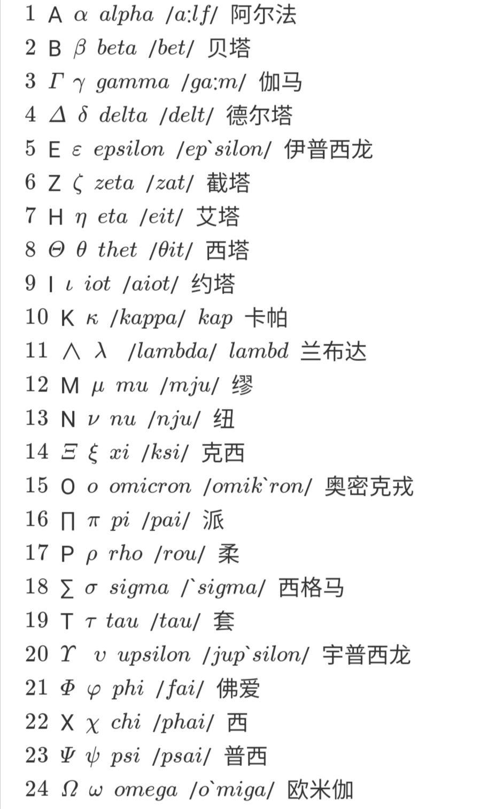

# 线性代数

## 向量基础

### 向量的来源

### 向量的表示

### 向量加法和数乘

### 向量的点乘

## 消元法

### 方程组

### 高斯消元法

### 高斯-诺尔当消元法

reef

## 向量空间

向量空间

列空间

零空间

矩阵的秩  跟解的关系

齐次方程 非齐次方程

特解

线性相关  基 维度

四个基本子空间

特殊矩阵回归

正交矩阵

对称矩阵

对角矩阵

上三角矩阵

下三角矩阵

旋转矩阵

## 行列式

## 特征值

### 对称矩阵
对称矩阵是指以主对角线为对称轴，各元素对应相等的矩阵。**即：A = Aᵀ**

**对称矩阵的性质**
1.实对称矩阵的所有​**​特征值都是实数​**​
2.特征向量正交

> [!NOTE] 证明：实对称矩阵的特征值都是实数
> 

因为特征向量的相互正交，所以特征向量线性无关，所以A=SΛS⁻¹，因为S是正交矩阵，所以A=QΛQᐪ，所以
$$\\
\begin{aligned}
A&=QΛQ^T\\

&=\begin{bmatrix}q_₁ & q_₂ & \cdots & q_ₙ\end{bmatrix}
\left[\begin{matrix}
 λ₁      & 0      & \cdots & 0      \\
 0      & λ₂      & \cdots & 0      \\
 \vdots & \vdots & \ddots & \vdots \\
 0      & 0      & \cdots & λₙ      \\
\end{matrix}\right]
\begin{bmatrix}q_₁^T \\ q_₂^T\\ \vdots \\ q_ₙ^T\end{bmatrix}\\

&=λ₁q_₁q_₁^T + λ₂q_₂q_₂^T + \cdots + λₙq_ₙq_ₙ^T

\end{aligned}$$

q₁q₁ᐪ是一个投影矩阵(rank=1)，所以每个对称矩阵可以分解为n多个互相垂直的投影矩阵! 或者说对称矩阵可以看成n个互相垂直的投影矩阵的线性组合。

> [!NOTE] q₁q₁ᐪ为什么是投影矩阵
> 向量的投影矩阵是：$P = (a a^T)/(a^T a)$
> 因为q是单位向量，也就是点积是1，即q₁ᐪq₁=1，所以q₁q₁ᐪ是投影矩阵

**如何判断特征值正负** #特征值正负判断
对于一些很大的矩阵，我们很难具体求出他的每个特征值，但是特征值的符号对我们很有意义，所以虽然很难求特征值，但是还是想知道特征值们的符号
**对称矩阵中主元的正负 = 特征值的正负**

### 复数矩阵

上面的对阵矩阵的性质，针对的是实对称矩阵，我们来推广到复数空间中；
首先对于向量点积的定义是：|a|² = $a^Ta$

> [!NOTE] 向量的点积
> 向量的点积，也称为​**​数量积​**​或​**​内积​**​，是一种将两个向量映射到一个标量的运算。

而对于复向量的点积是：$\overline{a}^Ta$

**共轭转置**
共轭转置是将复矩阵先取共轭，然后再进行转置，就是$\overline{Z}^T$，又记作：$Z^H$或者$Z^*$
性质：$(AB)^H=A^HB^H$

> [!NOTE] 证明$(AB)^H=A^HB^H$
> 

**埃尔米特矩阵**
如果一个复数矩阵 ​**​H​**​ 满足等于其共轭转置的条件，即$H^*=H$，那么它就是一个​**​埃尔米特矩阵​**​（或称自伴矩阵）。
- 埃尔米特矩阵的​**​主对角线上的元素必须是实数​**​（因为要求 $\overline{a}_{ii} = a_{ii}$）。
    
- 非对角线上的元素关于主对角线共轭对称，即 $\overline{a}_{ij} = a_{ij}$。
    
- 埃尔米特矩阵是实数领域中对称矩阵（$A^T=A$）在复数领域的推广。
所以跟实数领域的对称矩阵的性质一致，特征值都是实数，特征向量相互正交

**酉矩阵**

如果一个复数矩阵 ​**​U​**​ 满足 $U^∗U=UU^∗=I$（其中 ​**​I​**​ 是单位矩阵），那么它就是一个​**​酉矩阵​**​。

- 酉矩阵是实数领域中正交矩阵（$Q^TQ=I$）在复数领域的推广。
    
- 酉矩阵的列（或行）向量构成一组标准正交基。

**复数矩阵的应用-傅里叶变换** #傅里叶变换

### 正定矩阵

对称矩阵的特征值都为正数

> [!NOTE] 正定矩阵的其他定义
> 1.

**正定矩阵特质**
1.对称矩阵并且特征值都>0
2.

负定矩阵
不定矩阵

顺序主子式   奇数阶主子式 < 0，偶数阶主子式 > 0

## 数学公式表示法

$$
A = \begin{bmatrix}1 & 2 & 3 \\4 & 5 & 6 \\7 & 8 & 9\end{bmatrix}+ \begin{vmatrix}1 & 2 & 3 \\4 & 5 & 6 \\7 & 8 & 9\end{vmatrix}
$$

$$$x^{y^z}=(1+{\rm e}^x)^{-2xy^w}$$f(x)=x_2^3+1
$$

$$
对称矩阵性质：A = A^T

对称矩阵A^T

X⁰ 

markdown数学表达：https://blog.csdn.net/nuoyanli/article/details/96179976

上标 ¹²³⁴⁵⁶⁷⁸⁹⁰⁺⁻⁼˂˃⁽⁾˙*′˙ⁿº

### 1. 上标数字0-9等符号：

¹²³⁴⁵⁶⁷⁸⁹⁰⁺⁻⁼˂˃⁽⁾˙*′˙ⁿº

### 2. 上标26个大小写英文字母

ᵃᵇᶜᵈᵉᶠᵍʰⁱʲᵏˡᵐⁿᵒᵖʳˢᵗᵘᵛʷˣʸᶻ

ᴬᴮᒼᴰᴱᶠᴳᴴᴵᴶᴷᴸᴹᴺᴼᴾᴼ̴ᴿˢᵀᵁⱽᵂˣᵞᙆ

Aᵀ₁   ᵀ 

### 3. 上标中文大写数字、序号

㆒㆓㆔㆕㆖㆗㆘㆙㆚㆛㆜㆝㆞㆟

### 4. 其他上标小字符

ᵃ ᵇ ᶜ ᵈ ᵉ ᵍ ʰ ⁱ ʲ ᵏ ˡ ᵐ ⁿ ᵒ ᵖ ᵒ⃒ ʳ ˢ ᵗ ᵘ ᵛ ʷ ˣ ʸ ᙆ ᴬ ᴮ ᒼ ᴰ ᴱ ᴳ ᴴ ᴵ ᴶ ᴷ ᴸ ᴹ ᴺ ᴼ ᴾ ᴼ̴ ᴿ ˢ ᵀ ᵁ ᵂ ˣ ᵞ ᙆ ꝰ ˀ ˁ ˤ ꟸ ꭜ ʱ ꭝ ꭞ ʴ ʵ ʶ ꭟ ˠ ꟹ ᴭ ᴯ ᴲ ᴻ ᴽ ᵄ ᵅ ᵆ ᵊ ᵋ ᵌ ᵑ ᵓ ᵚ ᵝ ᵞ ᵟ ᵠ ᵡ ᵎ ᵔ ᵕ ᵙ ᵜ ᶛ ᶜ ᶝ ᶞ ᶟ ᶡ ᶣ ᶤ ᶥ ᶦ ᶧ ᶨ ᶩ ᶪ ᶫ ᶬ ᶭ ᶮ ᶯ ᶰ ᶱ ᶲ ᶳ ᶴ ᶵ ᶶ ᶷ ᶸ ᶹ ᶺ ᶼ ᶽ ᶾ ᶿ ꚜ ꚝ ჼ ᒃ ᕻ ᑦ ᒄ ᕪ ᑋ ᑊ ᔿ ᐢ ᣕ ᐤ ᣖ ᣴ ᣗ ᔆ ᙚ ᐡ ᘁ ᐜ ᕽ ᙆ ᙇ ᒼ ᣳ ᒢ ᒻ ᔿ ᐤ ᣖ ᣵ ᙚ ᐪ ᓑ ᘁ ᐜ ᕽ ᙆ ᙇ ⁰ ¹ ² ³ ⁴ ⁵ ⁶ ⁷ ⁸ ⁹ ⁺ ⁻ ⁼ ˂ ˃ ⁽ ⁾ ˙ * º

### 5. 下标数字0-9等小字符：

₀ ₁ ₂ ₃ ₄ ₅ ₆ ₇ ₈ ₉ ₊ ₋ ₌ ₍ ₎ ₐ ₑ ₒ ₓ ₔ ₕ ₖ ₗ ₘ ₙ ₚ ₛ ₜ

### 6. 下标英文字母符号

ₐ ₔ ₑ ₕ ᵢ ⱼ ₖ ₗ ₘ ₙ ₒ ₚ ᵣ ₛ ₜ ᵤ ᵥ ₓ ᙮ ᵤ ᵩ ᵦ ₗ ˪ ៳ ៷ ₒ ᵨ ₛ ៴ ᵤ ᵪ ᵧ

### 7.希腊字符

α β γ  π  λ

### 8 markdown数学公式
$\vec{a}$  向量
$\overline{a}$ 平均值
$\underline{a}$下横线
$\widehat{a}$ (线性回归，直线方程) y尖
$\widetilde{a}$ 颚化符号  等价无穷小
$\dot{a}$   一阶导数
$\ddot{a}$  二阶导数
$M_1 q_1$

[^1]: 
